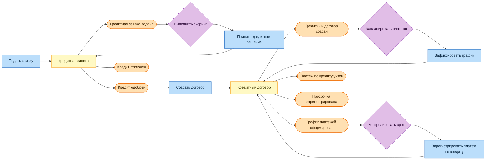

# Event Storming целевого процесса

## Легенда

- синий — команда пользователя или системы;
- жёлтый — агрегат, принимающий решение;
- оранжевый — состоявшееся доменное событие;
- фиолетовый — policy/process manager, реагирующий на событие;
- красный — событие защищённого клинического контура.

## Основной пациентский путь

```mermaid
flowchart LR
  C1[Зарегистрировать пациента]:::command --> A1[Пациент]:::aggregate
  A1 --> E1([Пациент зарегистрирован]):::event
  E1 --> P1{Открыть возможность записи}:::policy
  P1 --> C2[Записать на приём]:::command
  C2 --> A2[Запись на приём]:::aggregate
  A2 --> E2([Приём запланирован]):::event
  E2 --> C3[Начать визит]:::command
  C3 --> A2
  A2 --> E3([Визит начат]):::event
  E3 --> C4[Открыть клинический эпизод]:::command
  C4 --> A3[Клинический эпизод]:::aggregate
  A3 --> E4([Клинический эпизод открыт]):::protected

  E4 --> C5[Назначить исследование]:::command
  C5 --> A4[Диагностическое исследование]:::aggregate
  A4 --> E5([Исследование назначено]):::protected
  E5 --> C6[Зафиксировать результат]:::command
  C6 --> A4
  A4 --> E6([Исследование выполнено]):::protected

  E6 --> P2{Маршрутизировать в ИИ}:::policy
  P2 --> C7[Запустить ИИ-анализ]:::command
  C7 --> A5[ИИ-анализ]:::aggregate
  A5 --> E7([ИИ-исследование пройдено]):::protected
  E7 --> C8[Подтвердить результат врачом]:::command
  C8 --> A3
  A3 --> E8([Клиническое заключение подтверждено]):::protected

  E8 --> C9[Завершить визит]:::command
  C9 --> A2
  A2 --> E9([Визит завершён]):::event
  E9 --> P3{Сформировать начисление}:::policy
  P3 --> C10[Выставить счёт]:::command
  C10 --> A6[Счёт]:::aggregate
  A6 --> E10([Счёт выставлен]):::event
  E10 --> P4{Инициировать оплату}:::policy
  P4 --> C11[Провести платёж]:::command
  C11 --> A7[Платёж]:::aggregate
  A7 --> E11([Платёж получен]):::event
  A7 --> E12([Платёж отклонён]):::event
  E11 --> P5{Закрыть задолженность}:::policy
  P5 --> C12[Погасить счёт]:::command
  C12 --> A6
  A6 --> E13([Счёт погашен]):::event

  classDef command fill:#bbdefb,stroke:#1565c0,color:#0d2b45;
  classDef aggregate fill:#fff9c4,stroke:#f9a825,color:#3e3600;
  classDef event fill:#ffe0b2,stroke:#ef6c00,color:#3e2200;
  classDef protected fill:#ffcdd2,stroke:#b71c1c,color:#3e1111;
  classDef policy fill:#e1bee7,stroke:#7b1fa2,color:#32103d;
```

ИИ не ставит диагноз автоматически: событие `AIStudyAnalyzed` содержит заключение модели и требует
подтверждения врачом. Ошибка оплаты не откатывает завершённый визит — Billing ведёт задолженность отдельным
процессом.

## Кредитный путь

## Источники и подписчики

| Событие                       | Контекст-источник     | Основные подписчики                                     | Реакция                                                         |
|-------------------------------|-----------------------|---------------------------------------------------------|-----------------------------------------------------------------|
| `PatientRegistered`           | Управление пациентами | Расписание и приём; Клиническая практика; Data Products | Создать локальную проекцию пациента                             |
| `PatientConsentChanged`       | Управление пациентами | Клиническая практика; Диагностика; ИИ; Data Products    | Пересчитать допустимость обработки и выдачи данных              |
| `AppointmentScheduled`        | Расписание и приём    | Клиническая практика; Data Products                     | Подготовить приём, обновить загрузку                            |
| `VisitCompleted`              | Расписание и приём    | Биллинг; Data Products                                  | Рассчитать стоимость, обновить операционные метрики             |
| `DiagnosticStudyOrdered`      | Клиническая практика  | Диагностика                                             | Создать исследование по назначению                              |
| `DiagnosticStudyCompleted`    | Диагностика           | Оркестрация ИИ; Клиническая практика                    | Запустить разрешённый анализ, показать результат врачу          |
| `AIStudyAnalyzed`             | Оркестрация ИИ        | Клиническая практика; мониторинг моделей                | Передать результат на проверку человеком, записать метрики      |
| `InvoiceIssued`               | Биллинг               | Платежи; Data Products                                  | Создать платёжное намерение, обновить дебиторскую задолженность |
| `PaymentReceived`             | Платежи               | Биллинг; Кредитование; Data Products                    | Погасить счёт/обязательство, обновить финансовую проекцию       |
| `LoanAgreementCreated`        | Кредитование          | Платежи; Data Products                                  | Подготовить платежи, обновить кредитный портфель                |
| `LoanPaymentOverdue`          | Кредитование          | коммуникации; риск-мониторинг; Data Products            | Уведомить клиента и запустить процесс взыскания                 |
| `EmployeeTerminated`          | Персонал              | Расписание и приём; IAM; аудит                          | Закрыть будущие слоты и отозвать доступ                         |
| `ResourceAvailabilityChanged` | Ресурсы и инвентарь   | Расписание и приём                                      | Открыть или закрыть слоты с зависимым ресурсом                  |

Точные контракты и классификация событий приведены в [events.md](events.md).

