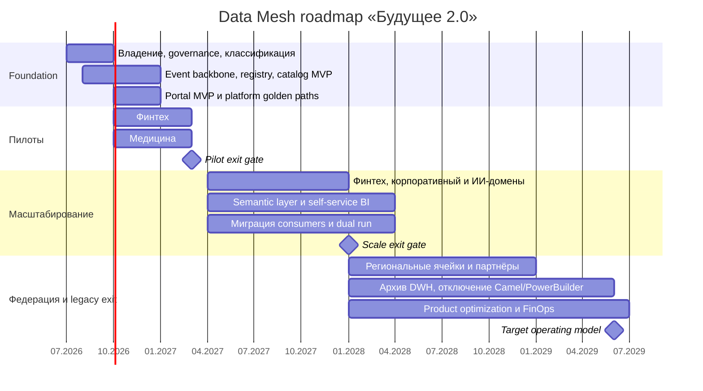

# Стратегический roadmap внедрения Data Mesh

## Цели и принципы программы

Data Mesh внедряется не как новый центральный Lakehouse, а как операционная модель: домены владеют data
products, платформенная команда предоставляет self-service capabilities, а общие правила исполняются как код.

| ID | Бизнес-цель к концу 36-го месяца                    | Целевой показатель                                                                               |
|----|-----------------------------------------------------|--------------------------------------------------------------------------------------------------|
| G1 | Быстрее подключать направления, регионы и партнёров | Lead time нового data product/integration ≤4 недель вместо нескольких месяцев                    |
| G2 | Принимать операционные решения быстрее              | Критичные разрешённые события доступны потребителю p95 ≤5 секунд                                 |
| G3 | Снизить зависимость от центральных DWH/BI-команд    | ≥70% типовых аналитических запросов выполняются self-service                                     |
| G4 | Повысить доверие к данным                           | ≥95% production data products имеют owner, SLO, lineage и quality score; 10 ключевых KPI сверены |
| G5 | Защитить клинические и финансовые данные            | 100% продуктов классифицированы; 0 клинических payload в Lakehouse; решения доступа аудируются   |
| G6 | Вывести legacy из критического пути                 | Нет новых Camel/DWH flows; SQL Server 2008 и PowerBuilder закрыты либо read-only archive         |
| G7 | Улучшить экономику изменений                        | Run-rate года 3 ≤128 млн руб.; unit cost и доменный showback доступны ежемесячно                 |

## Этапы

Даты задают последовательность от июля 2026 года и могут быть сдвинуты целиком после бюджетного решения;
exit criteria важнее календарной даты.

## 0–6 месяцев: foundation и два пилота

**Бизнес-фокус:** доказать G2/G4/G5 на ограниченном scope и не строить платформу без потребителей.

| Поток работ                | Результат                                                                                                  | Владелец                           | Exit criteria                                                      |
|----------------------------|------------------------------------------------------------------------------------------------------------|------------------------------------|--------------------------------------------------------------------|
| Operating model            | Назначены Data Product Owner (DPO) медицинского и финтех-доменов, Data Stewards и Platform Product Manager | CDO + руководители доменов         | У каждой пилотной сущности есть accountable owner и финансирование |
| Federated governance       | Общие policies: classification, naming, schema compatibility, SLO, residency, retention                    | Governance Council + Security      | Policy-as-code в CI; исключения имеют owner и срок                 |
| Self-service platform MVP  | Kafka, Schema Registry, S3/Iceberg, Trino, OpenMetadata, quality gates, telemetry                          | Platform Product Manager           | Multi-AZ/recovery test, catalog search, шаблон публикации ≤1 день  |
| Пилот «финансовые расчёты» | `VisitCompleted → InvoiceIssued → PaymentReceived`, сертифицированный finance data product                 | Финтех DPO + Data Engineer         | Сверка с DWH ≥99,9%; идемпотентный replay; p95 события ≤5 с        |
| Пилот «пациентский поток»  | Минимизированные события загрузки/очереди; клинические данные исключены                                    | Медицинский DPO + Privacy/Security | DLP-тесты пройдены; 0 PHI в Lakehouse; утверждён lineage           |
| Portal MVP                 | Поиск продуктов, 10 приоритетных метрик, контролируемые запросы/выгрузки                                   | BI Lead + Portal team              | RBAC/ABAC, audit, quota; ≥20 пилотных пользователей                |
| Измерение baseline         | Lead time, часы аналитиков, incidents, cloud/license cost и quality baseline                               | FinOps + BI Lead                   | Dashboard с baseline принят steering committee                     |

**Gate 1:** не масштабировать платформу, пока два продукта не имеют активных consumers, подписанный SLO,
quality score, recovery/replay proof и подтверждённую стоимость единицы нагрузки.

## 7–18 месяцев: масштабирование доменов

**Бизнес-фокус:** G1/G3/G4 — превратить пилот в повторяемый onboarding, а не набор ручных исключений.

| Поток работ           | Результат                                                                                         | Владелец                 | Exit criteria                                                              |
|-----------------------|---------------------------------------------------------------------------------------------------|--------------------------|----------------------------------------------------------------------------|
| Domain enablement     | Подключены кредитование, корпоративный и разрешённый ИИ-контур; в каждом есть DPO и Data Engineer | Domain Leads             | ≥2 production data products на домен; on-call и SLO работают               |
| Paved road            | Шаблоны outbox/CDC, data contract, quality, lineage, IAM, dashboards и cost tags                  | Platform Product Manager | Новый продукт проходит стандартный путь ≤4 недель                          |
| Semantic layer        | Единые определения 10 ключевых KPI и процесс разрешения semantic conflicts                        | BI Lead + DPO Council    | Portal и регламентный BI дают значения в пределах утверждённой погрешности |
| Self-service adoption | Обучение BI-аналитиков, office hours, certified datasets и reusable report templates              | BI Lead                  | ≥50% типовых запросов self-service; удовлетворённость ≥4/5                 |
| Consumer migration    | Dual run, автоматическая сверка и перенос чтения с DWH на data products                           | Migration Lead           | ≥60% целевых consumers мигрировали; rollback проверен                      |
| Reliability/security  | DR, capacity, data access review, lineage и incident exercises                                    | SRE Lead + CISO          | SLO ≥99,9%; RPO/RTO доказаны; критичные findings закрыты                   |
| FinOps                | Showback по домену/product, quotas и unit economics                                               | FinOps Lead + DPO        | 100% ресурсов размечены; forecast отклоняется от факта ≤10%                |

**Gate 2:** домен получает автономию публикации только после прохождения product scorecard. Camel/DWH freeze
контролируется архитектурным советом; новый legacy-маршрут требует исключения CTO.

## 19–36 месяцев: федерация, регионы и вывод legacy

**Бизнес-фокус:** G1/G6/G7 — масштабировать организационную модель и получить экономический эффект.

| Поток работ           | Результат                                                                                     | Владелец                       | Exit criteria                                                                      |
|-----------------------|-----------------------------------------------------------------------------------------------|--------------------------------|------------------------------------------------------------------------------------|
| Federated mesh        | DPO Council управляет общими interoperability rules; домены самостоятельно выпускают продукты | CDO + DPO Council              | ≥95% продуктов соответствуют scorecard; violations имеют remediation SLO           |
| Регионы и партнёры    | Региональные data cells, locality policies и стандартный partner onboarding через ACL         | Platform + Partner DPO         | Новый регион/партнёр ≤4 недель; cross-region transfer полностью учтён              |
| Legacy exit           | История архивирована, consumers мигрировали, Camel/SQL 2008/PowerBuilder отключены            | Migration Lead + system owners | Нет активных consumers; reconciliation, RPO/RTO, rollback и sign-off выполнены     |
| Product lifecycle     | Usage/cost review, deprecation и удаление неиспользуемых data products                        | DPO + FinOps                   | 100% продуктов имеют usage; неиспользуемые закрываются по политике                 |
| Continuous enablement | Communities of practice, competency matrix и onboarding команд                                | Data Enablement Lead           | Нет single-person dependency; минимум два подготовленных специалиста на capability |
| Benefits realization  | P&L-эффект, analyst capacity и run-rate сопоставлены с TCO base case                          | CFO + Transformation Director  | Run-rate ≤128 млн; benefit register подтверждён владельцами P&L                    |

## Роли и модель ответственности

| Роль                       | Основная ответственность                                                     | Ключевые решения и метрики                                                       |
|----------------------------|------------------------------------------------------------------------------|----------------------------------------------------------------------------------|
| Data Product Owner         | Ценность, roadmap, consumers, семантика, SLO и бюджет data product           | Adoption, freshness, quality, consumer NPS, unit cost; принимает/отклоняет scope |
| Data Engineer домена       | Pipeline, контракт, тесты, lineage, эксплуатация и восстановление            | Delivery lead time, failed runs, data quality, MTTR, replay success              |
| BI-аналитик                | Метрики, semantic model, dashboards, обучение пользователей и обратная связь | Доля self-service, reuse метрик/отчётов, time-to-insight, расхождение KPI        |
| Data Steward               | Термины, классификация, metadata completeness и правила качества             | Completeness каталога, glossary conflicts, policy compliance                     |
| Platform Product Manager   | Paved road как продукт, backlog платформы и developer experience             | Onboarding time, platform adoption, availability, cost per product               |
| Platform/SRE Engineer      | Надёжность, capacity, observability, DR, automation и incident response      | SLO, RPO/RTO, MTTR, consumer lag, toil                                           |
| Security & Privacy Officer | Policy, consent, locality, threat model и контроль защищённого контура       | Policy violations, access review, DLP findings, audit completeness               |
| Data Governance Council    | Минимальный набор федеративных правил и разрешение междоменных конфликтов    | Скорость принятия standards/exceptions, interoperability compliance              |
| FinOps Lead                | Forecast, showback, unit economics и оптимизация ресурсов                    | Budget variance, idle cost, cost/event/query/product                             |
| Transformation Director    | Зависимости, бюджет, gates, benefits и legacy exit                           | Milestones, TCO, benefit realization, доля выведенного legacy                    |

## RACI ключевых результатов

`A` — accountable, `R` — responsible, `C` — consulted, `I` — informed.

| Результат                              | DPO | Data Engineer | BI-аналитик | Platform | Governance/Security | FinOps |
|----------------------------------------|-----|---------------|-------------|----------|---------------------|--------|
| Data product и его SLO                 | A   | R             | C           | C        | C                   | I      |
| Data contract и pipeline               | C   | A/R           | C           | C        | C                   | I      |
| KPI/semantic model                     | A   | C             | R           | I        | C                   | I      |
| Self-service platform capability       | C   | C             | C           | A/R      | C                   | C      |
| Classification/access/retention policy | C   | R             | I           | R        | A                   | I      |
| Product showback и unit cost           | A   | C             | I           | R        | I                   | R      |
| Cutover legacy consumer                | A   | R             | R           | C        | C                   | I      |

## Product scorecard и контроль программы

Data product допускается в production, если определены owner и consumers, контракт и business glossary,
classification/region/retention, SLO и support, automated quality tests, lineage, access policy, usage telemetry,
unit cost и deprecation policy. Scorecard публикуется в OpenMetadata.

Steering committee ежемесячно контролирует TCO, бизнес-эффект, риски и exit gates. DPO Council раз в месяц
решает semantic/interoperability conflicts. Platform и domain teams ежеквартально пересматривают tech radar и
product portfolio. Финансирование следующего этапа разблокируется доказательствами предыдущего gate, а не
только выполнением календарного плана.

